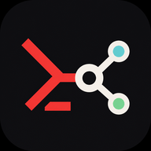

#  agc-cli

**AppGallery Connect Command Center** — manage your Huawei apps from the terminal.

[](https://github.com/Createitv/agc-cli/actions/workflows/ci.yml)
[](go.mod)
[](https://github.com/Createitv/agc-cli/releases)
[](https://github.com/Createitv/agc-cli/releases)
[](LICENSE)

[简体中文](README.md) · **English** · [Website](https://agccli.app/)

A Go CLI for AppGallery Connect: query apps, build publishing requests, and invoke testing, product, and reporting APIs from your terminal or CI. Structured JSON output makes it usable by scripts and AI agents.

## Quick Start

You need an app ID and a Service Account JSON file. Manage your apps and credentials in [AppGallery Connect](https://developer.huawei.com/consumer/cn/service/josp/agc/index.html). On macOS, install with Homebrew:

```bash
brew tap createitv/tap && brew install agc-cli

agc auth login --service-account-file ~/.agc/service-account.json --name production
agc init --app-id YOUR_APP_ID --default-profile production

# Preview the query; add --dry-run=false to send it
agc publishing app-info-query --invoke --query appId=YOUR_APP_ID --query lang=en-US
```

Multiple accounts, Windows/Linux installation, and CI environment variables: [user guide](docs/CLI_USAGE.en.md). Building from source: [Contributing](CONTRIBUTING.md#english). Project initialization selects a credential profile; app parameters remain explicit. Supply `--header client_id=YOUR_CLIENT_ID` when required by the endpoint.

## Built for Agents

Endpoint definitions include `affordances` command templates and `_links` REST routes so agents can discover the next operation without memorizing the command tree. An excerpt from `agc publishing app-info-query --pretty`:

```json
{
  "data": {
    "id": "app-info-query",
    "method": "GET",
    "path": "/api/publish/v2/app-info",
    "affordances": {
      "show": "agc publishing app-info-query --pretty",
      "invoke": "agc publishing app-info-query --invoke"
    }
  }
}
```

JSON is the default; add `--output table` or `--output markdown` for people. `agc web-server` exposes a local REST API. Templates require parameters and currently do not check remote business state to determine submission readiness. More in the [agent and REST guide](docs/CLI_USAGE.en.md#json-and-agents).

## What It Covers

| Area | What you can do |
| --- | --- |
| **Apps & Publishing** | Query/update metadata, package information, and localizations; build submission and release timing requests → [release workflow](docs/CLI_USAGE.en.md#app-release-workflow) |
| **Uploads** | Discover upload URL, multipart, and confirmation endpoints; complete binary/multipart uploads still require an external tool → [upload notes](docs/CLI_USAGE.en.md#app-release-workflow) |
| **Testing** | Invoke test version, tester, group, invitation, and feedback endpoints → `agc testing` |
| **Products & Subscriptions** | Invoke product, pricing, promotion, and localization endpoints → `agc pms` |
| **Signing & Devices** | Invoke HarmonyOS certificate, provisioning profile, device, ACL, and fingerprint endpoints → `agc provisioning` |
| **Reviews & Reports** | Query ratings/reviews, manage replies, request reports, and save raw responses → `agc comments` / `agc reports` |
| **Projects & Domains** | Query teams/projects/SDK configs and invoke atomic service domain endpoints → `agc projects` / `agc domains` |
| **Games & Resources** | Inspect game callback contracts and resource predownload endpoints → `agc gameplay` / `agc game-items` / `agc resources` |
| **REST & Web** | Browse the registry, preview/invoke local REST requests, export OpenAPI → [local usage](docs/CLI_USAGE.en.md#web-rest-and-openapi) |

The registry contains 13 API families and 156 entries with generic request construction/invocation. Follow each endpoint's Huawei `sourceUrl` for fields, permissions, and prerequisites. Upload orchestration and local Hvigor execution are not yet implemented.

All guides: [docs index](docs/README.md). Every command and flag: `agc --help` or `agc <family> <endpoint> --help`. Run `agc endpoints --pretty` for definitions and official references.

## More

- [Release workflow](docs/CLI_USAGE.en.md#app-release-workflow) — query → upload → complete metadata → submit → check remote state
- [Contributing](CONTRIBUTING.md#english) — build, test, code organization, and submitting changes
- [Changelog](CHANGELOG.md) · [Release downloads](https://github.com/Createitv/agc-cli/releases)
- [Issues](https://github.com/Createitv/agc-cli/issues) — include your version, a redacted command, and error details

## License

[MIT](LICENSE).
